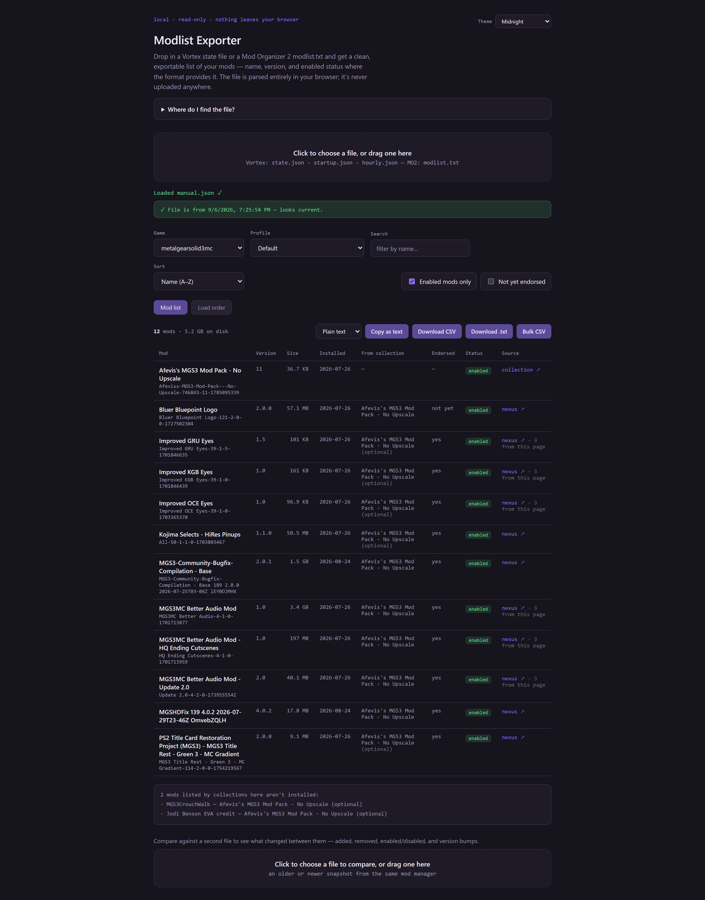

# Modlist Exporter

[](LICENSE)

Browse and export your installed mods from your mod manager. Supports Vortex
and Mod Organizer 2. Runs entirely in your browser, with exports available as
CSV, plain text, Markdown, BBCode, or clipboard copy.

**[Live demo](https://therealestnwah.github.io/modlist-exporter/)**



<sub>Example data — not a real load order.</sub>

## Features

- Drag-and-drop (or click-to-browse) file loading — nothing ever leaves your
  browser, no server involved
- **Supports two mod managers:**
  - **Vortex** — auto-detects games and profiles from the state file; shows
    version, enabled/disabled status per profile, and a Nexus source link
    where available. Installed Nexus **collections** are labelled as such and
    link to the collection page, instead of appearing as ordinary mods with
    nothing to click
  - **Mod Organizer 2** — reads `modlist.txt` directly; shows mod name,
    enabled/disabled status, and the mod's position in MO2's priority pane,
    with an optional sort by that order (MO2's format doesn't store version
    or source data)
- **Collection membership** — shows which installed mods came from which
  Nexus collection, whether the collection required or merely recommended
  them, and which of a collection's mods you don't have installed
- **Endorsement status** — see at a glance which mods you've endorsed on
  Nexus, with a filter for the ones you haven't got round to
- **Search and sort** — filter the list by name, mod ID, version or source;
  sort by name, install size, or MO2 priority order
- **Install size** — per-mod size and a total for whatever is currently shown,
  so you can see what's actually using the disk (Vortex only; MO2's
  `modlist.txt` records no sizes)
- **File freshness check** — flags when the loaded file is more than a
  couple days old, so you don't export a stale list without realizing it
- **Compare two snapshots** — load a second file to see what changed between
  them: added, removed, enabled/disabled, version bumps, and priority moves
- Export as CSV, plain `.txt`, or copy straight to clipboard (the changes
  view exports too, as `*-changes.csv` / `*-changes.txt`)
- **Markdown and BBCode** — a format picker next to the export buttons, for
  posting a load order on a forum, a wiki, or in a repo
- **Three themes** — Midnight, Nexus and Liquid Glass, picked in the header
  and remembered per browser
- **All-games export** — every Vortex game in one CSV with a `Game` column,
  for when you want the whole setup rather than one game at a time

## Structure

This is a single self-contained file — no build step, no dependencies to
install.

- `index.html` — everything (markup, CSS, JS) lives in this one file.
- `test/` — tests. Development only; nothing here is needed to use the tool.
- `docs/` — the README screenshot and the social preview image. Neither is
  loaded by the tool; `og.png` is only ever fetched by a crawler when someone
  shares the link.

## Running it

Just double-click `index.html`, or serve it locally:

```bash
python3 -m http.server 8000
# then open http://localhost:8000
```

## Tests

```bash
node --test test/*.test.js
```

No dependencies and no build step. Because `index.html` is deliberately one
self-contained file with nothing to import, `test/extract.js` lifts the pure
(DOM-free) functions out of it and evaluates them. There are two script
elements — a small one in the head that applies the stored theme before first
paint, and the main one at the end — so the harness picks the block by looking
for the one that defines `parseModlist()` rather than by position. The
functions it lifts:
`parseMO2`, `parseModlist`, `buildRows`, `viewState`, `diffRows`,
`indexModsForMatching`, `matchRule`, `collectionMembership`,
`collectionLabel`, `missingCollectionMembers`, `endorsementLabel`,
`isUnendorsed`, `defaultProfileFor`, `gamesWithMods`, `allGamesRows`,
`formatSize`, `matchesQuery`, `statusLabel`, `csvCell`, `diffDetail`,
`mdCell`, `bbSafe`, `safeHttpUrl`, `mdLink`, `bbLink`, `markdownLines`,
`bbcodeLines`, `markdownDiffLines`, `bbcodeDiffLines`, `themeIds`,
`resolveTheme` and `themeMeta`.

That list is maintained by hand. Adding a helper that existing functions call,
without adding it here, breaks a lot of tests at once — which is loud, but
worth knowing about before it happens.

That couples the tests to the file's shape — each of those must stay declared
at two-space indentation inside the IIFE. If one is renamed or re-indented,
extraction fails loudly by name rather than silently testing nothing.

The suite covers marker parsing, separator handling, MO2's reversed priority
order, the Vortex attribute fallbacks, Nexus mod and collection link
construction (including rejecting a malformed slug), collection membership
matching and uninstalled-member detection, endorsement states, size
formatting and sorting, the all-games export's per-game profile selection,
the tri-state enabled/unknown status, every diff classification, the CSV
formula-injection guard, the Markdown and BBCode escaping, and the theme
resolution that decides what a stored preference means.

`render()` is deliberately split in two: `viewState()` decides *what* should
be shown — filtering, sorting, column visibility, totals — and `render()` does
nothing but draw the result. Every render-layer bug found so far has been a
decision bug rather than a drawing bug (a column-visibility check reading
stale state; a note firing for a format it didn't apply to), and neither
needed a browser to catch. Keeping the decisions DOM-free is what makes them
testable without adding a dependency or a build step to a single-file
project.

That leaves the wiring untested — whether a listener is attached, whether an
element ID is right. Those fail loudly on first load rather than silently
producing wrong output, which is why this trade is worth making.

One test is skipped unless you have local Vortex backups: if
`%APPDATA%\Vortex\temp\state_backups_full\` holds two or more state files, it
parses and diffs them as a real-world check. Nothing from those files is
committed.

Tests run in CI on every pull request into `main`.

## Releasing

`main` holds finished work that hasn't shipped yet — pushing to it does not
change the live site. The GitHub Pages deploy runs only when a release is
**published** on GitHub, and it deploys the commit that release's tag points
at.

So the flow is: merge to `main` freely, then publish a release when you want
those changes live. Pushing a bare tag isn't enough — the release itself has
to be published. There's a manual "Run workflow" button on the Actions tab if
you ever need to redeploy without cutting a release.

### The github-pages environment needs a tag policy

This is repository configuration, not something in this repo, and it is easy
to lose. A `release` event runs against the **tag** ref, not a branch. If the
`github-pages` environment is restricted to deploying from `main` only — which
is how GitHub sets it up by default — then a release-triggered deploy is
rejected before it starts.

The failure is nasty to diagnose: the job completes in about two seconds with
`failure`, an **empty step list**, and no error message anywhere in the logs,
because it never got as far as running a step.

The fix is to allow tags to deploy, under
**Settings → Environments → github-pages → Deployment branches and tags**:
add a rule of type *tag* matching `*`, alongside the existing `main` branch
rule. Equivalently, via the API:

```bash
gh api -X POST \
  repos/:owner/:repo/environments/github-pages/deployment-branch-policies \
  -f name='*' -f type=tag
```

Worth re-checking if that environment is ever recreated, or if you fork this
repo and enable Pages on the fork.

## How it works

The tool detects the format automatically based on file content, not
extension:

- **If the file parses as JSON**, it's treated as a Vortex state file. It
  looks for `persistent.mods[gameId][modId]` (falls back to an unwrapped
  root if `persistent` isn't present, since some backup files are stored
  unwrapped), and cross-references `persistent.profiles[profileId].modState`
  to determine enabled/disabled status per profile.
- **If it isn't valid JSON**, it's parsed as an MO2 `modlist.txt` — each
  line's leading marker determines status (`+` enabled, `-` disabled, `*`
  unmanaged base-game/DLC content), and the rest of the line is the mod
  name. Comment lines (`#`) and blanks are skipped, and MO2's
  `*_separator` entries are dropped so they don't pollute the list or the
  count. Each entry's file position is recorded and then reversed to
  recover MO2's pane order — see "Priority order in modlist.txt" below.

In both cases:
- Nothing is ever uploaded anywhere — parsing happens with `FileReader` +
  `JSON.parse` entirely in-browser.
- The browser's `File.lastModified` timestamp is checked against the current
  time to warn if the snapshot looks stale.
- Results render into a table with CSV / .txt / clipboard export, where the
  copy and text-download buttons render as plain text, Markdown or BBCode.
  Sorting is by name, install size, or — for MO2 files only — priority
  order. Every
  column and sort option hides itself where the format carries no such data:
  MO2 files have no sizes, collections or endorsement state, and Vortex files
  have no equivalent of MO2's priority order.
- Sizes come from Vortex's `modSize` (falling back to `fileSize`), in bytes.
  The CSV export includes both the formatted size and the raw byte count, so
  it stays sortable in a spreadsheet.
- The search box filters on name, mod ID, version, source and collection
  name — so searching a collection finds its members. Multiple terms all have
  to match, in any order.
- Mod names come from mod authors, so they're treated as untrusted: table
  cells are built as DOM text nodes rather than HTML, Nexus links are only
  constructed when the game and mod IDs actually look like IDs, and CSV
  fields that begin with `=`, `+`, `-` or `@` are quote-prefixed so
  spreadsheet apps don't evaluate them as formulas. The Markdown export
  escapes the characters that would end a table cell or open a link, and
  entity-escapes `<` since Markdown passes raw HTML to the renderer. BBCode
  has no escape its forum software agrees on, so square brackets in a name
  are swapped for parentheses — lossy, but it can't open a tag.

## Collection membership, and why it's a guess

This is the one place the tool infers rather than reports, so it's worth
being explicit about.

A Nexus collection installs as a mod that carries its members in a `rules`
array. But those rules reference members by `fileMD5`, `logicalFileName` or
`description` — **not** by the installed mod's ID. So membership has to be
matched rather than looked up. The matcher tries the most precise key first:

1. `fileMD5` — exact
2. `logicalFileName`
3. `description`, against a mod's name

Against the 436 real mods and 52 collection rules this was developed with,
**49 of 52 (94%)** resolved. A rule that matches nothing simply means that
member isn't installed, which is entirely normal for a `recommends` you
declined — it isn't an error and nothing is reported for it.

Mods a collection lists that you don't have installed are reported in a note
below the table, rather than being dropped silently. That is what the
unmatched rules mean — often a recommendation you declined — and it's more
useful shown than hidden.

Practical consequences: a mod is only attributed if it's actually installed,
attribution can in principle be wrong if two different mods share a name and
neither has a usable md5, and a mod belonging to two collections lists both.
Collections are never listed as members of themselves. Membership is
deliberately **not** compared in the changes view — a mod's collection rarely
changes, and matching noise there would be worse than the signal.

## Themes

Three, picked from the header and remembered in `localStorage` per browser:

- **Midnight** — the default. Dark, violet accent.
- **Nexus** — near-black with amber calls to action, in the spirit of the site
  most of these mods come from.
- **Liquid Glass** — light and translucent: surfaces blur what is behind them,
  over a lit background that gives them something to refract.

A theme is a block of custom properties. Colour, the tints behind badges and
notices, the text that sits on a solid fill, and the corner radii are all
tokens on `:root`, so a theme mostly restates values rather than rewriting
rules. Liquid Glass is the one that adds rules of its own, for the blur and
the bright inner edge along the top of each surface.

Two details that are easy to miss:

- Native controls — checkboxes, the select chevron, the mobile browser chrome —
  follow the `color-scheme` and `theme-color` meta tags, not our variables. The
  switcher rewrites both. Without that, an unchecked box on the light theme
  paints as a solid dark square.
- The stored preference is applied by a small script in the head, before the
  body paints, or the default would flash first. Anything unrecognised in
  storage resolves back to Midnight, since what is in there is whatever was
  last written — including by an older version of this file.

Liquid Glass drops to opaque surfaces on a flat background under
`prefers-reduced-transparency: reduce`, which is what macOS and iOS set from
their Reduce Transparency switch, and does the same where the browser cannot
blur at all.

## Sharing a load order

The format picker in the export bar switches the **Copy** and text **Download**
buttons between plain text, Markdown and BBCode. The other two buttons are
unaffected — CSV is always CSV.

Markdown writes a table, with the mod name as a link to its Nexus page where
there is one. Columns follow the same rule as the page itself: `#`, size,
collection and endorsement appear only if the loaded file carries them. The
Source and Source URL columns the CSV needs are left out, since the linked
name already carries both.

BBCode writes a `[list]` rather than a table, because forum table markup isn't
portable across forum software. Where an order exists it's written into each
line as text rather than left to `[list=1]` auto-numbering — the table can be
sorted by name while still holding MO2 priority numbers, and auto-numbering
would quietly renumber the load order to match the sort.

Both formats also work in the changes view, exporting the diff instead.

## Exporting every game at once

The **All games CSV** button appears when a Vortex file contains more than one
game. It writes one row per mod across every game, with a `Game` column, fixed
columns so the sheet stays rectangular, and both the formatted size and the raw
byte count.

Deliberately one flat sheet rather than a tab per game: a `Game` column can be
filtered, sorted and pivoted in any spreadsheet app, which answers "what's my
largest mod across everything" or "how much disk per game" directly. Separate
tabs can't do that without extra work, and a real multi-sheet `.xlsx` would
mean either a ~900KB library inlined into this file or a CDN script — and the
page currently makes no network requests at all, which is rather the point.

Enabled state lives on the profile, so each game uses its most recently
activated one; a game with no profile at all falls back to its full installed
list, where status reads as unknown. The search, enabled-only and
not-yet-endorsed filters all apply per game, so the export matches what you'd
see stepping through each game in turn.

## Endorsement

Vortex records whether you've endorsed each mod on Nexus. The tool surfaces
that as a column, and the **Not yet endorsed** filter narrows the list to the
ones still waiting on you — which for a large setup is usually most of them.

"Not yet" means Vortex has the mod as *Undecided*. Deliberately excluded:
*Abstained*, because that's a decision you already made, and mods with no
endorsement state at all, which are the ones that didn't come from Nexus and
can't be endorsed.

## Comparing two snapshots

Load a file, then drop a second one into the compare box that appears below
the results. The two are matched by mod ID (mod name, for MO2) and reported
as added, removed, changed or unchanged.

Direction is decided by each file's timestamp, not the order you load them
in — the older file is always the baseline, so "added" means a mod appeared
over time regardless of which one you picked first.

Results can be filtered by change type — added, removed, changed and
unchanged each toggle independently, and each filter shows its own tally so
the counts stay visible even when a type is switched off. Unchanged is off
by default. Exports follow whatever the filter is currently showing.

Both files must come from the same mod manager; comparing a Vortex state
file against an MO2 `modlist.txt` is refused rather than producing
nonsense.

A caveat specific to Vortex: enabled/disabled state lives on the *profile*,
so if the profile you're viewing doesn't exist in the other file, that side
falls back to its full installed-mod list and status can't be compared. In
that case only additions, removals and version changes are reported, and
the comparison says so. This matters because treating "unknown" as a change
would otherwise mark every single mod as modified.

## Notes on file locations

### Vortex

Vortex has no built-in "export modlist" feature. Its mod/profile state is
written as periodic JSON snapshots under:

```
%AppData%\Vortex\temp\state_backups_full\
```

Files you may find there, in rough order of freshness:

- `manual.json` — only created when the user explicitly triggers a backup via
  **Settings → Workarounds → Backup** in Vortex. This is the most reliable
  way to get a fresh snapshot on demand.
- `startup.json` — rewritten each time Vortex launches.
- `hourly.json` — rewritten roughly once per hour while Vortex is running.

A `startup.json` also exists directly under `%AppData%\Vortex\` (not inside
`temp\state_backups_full`) — that one is a smaller session/window-settings
file and does **not** contain mod data. Easy to grab by mistake.

**Known issue:** on at least one real install, the automatic backup scheduler
silently stopped updating `startup.json`/`hourly.json` (both sat stale for
weeks despite mods being installed/removed in that time), with no obvious
error surfaced to the user. No root cause was confirmed. The manual backup
button was a reliable workaround — this is exactly what the freshness
warning in the tool now helps catch early.

### Mod Organizer 2

MO2 keeps a plain-text modlist per profile at:

```
<MO2 install folder>\profiles\<profile name>\modlist.txt
```

Unlike Vortex, this file updates live as mods are installed, enabled, or
disabled — there's no periodic-backup staleness concern here. It only
records mod name and enabled state; version numbers and source links aren't
part of this format, so those columns will show as empty for MO2 files.

Exports are named after the detected format: `vortex-modlist.csv` /
`mo2-modlist.csv`, and likewise for `.txt`. Markdown downloads as `.md`;
BBCode downloads as `.txt`, since no extension for it is standard and it's
meant to be pasted into a forum rather than opened. The changes view adds
`-changes`, and the all-games export is `vortex-modlist-all-games.csv`.

#### Priority order in modlist.txt

`modlist.txt` is written in **reverse** of the order MO2 shows in its left
pane. The first line of the file is the *bottom* of the pane, and the last
line is the top. Because mods lower in MO2's pane win file conflicts, that
means **line 1 is the highest priority and the last line is priority 0** —
the opposite of the intuitive reading.

This was verified against a real profile on 2026-09-05 rather than assumed.
Two things confirmed it: `ModOrganizer.ini` records the pane's display order
in `MainWindow_modList_index`, ending with the `Overwrite` entry that MO2
always pins to the bottom of the pane, and that order is the exact reverse
of the file. The pane's top row was then checked directly in MO2.

The `#` column and the "MO2 priority order" sort both reverse the file to
match what you see in MO2, numbering from 1 at the top of the pane.
Separators occupy a slot in that ordering (as they do in MO2) but are not
themselves listed. The column is hidden for Vortex files, which carry no
comparable ordering.

## Roadmap / ideas

- [x] Warn when the loaded file looks stale
- [x] Support Mod Organizer 2's modlist export format alongside Vortex's JSON
- [x] Surface MO2's priority order (verified: the file is stored reversed
      relative to MO2's pane)
- [x] Diff view between two loaded snapshots (what was added/removed/updated)
- [x] Search, sort, and per-mod install sizes
- [x] Attribute mods to the collection they were installed from, and report
      collection members that aren't installed
- [x] Endorsement status, with a filter for mods not yet endorsed
- [x] Export every Vortex game at once, in one CSV
- [x] Markdown / BBCode export, for sharing a load order on a forum
- [ ] Surface Vortex load order when present in the state file
      (game-extension dependent)
- [ ] Folder-watch / auto-refresh via the File System Access API

## AI disclosure

This project's code, documentation, and repo setup — including the GitHub
Actions workflows and the test suite — were built in collaboration with
Claude (Anthropic), used conversationally to write and iterate on the
implementation, debug the GitHub Pages deployment, and draft this README.

Testing is a mix. The automated suite was written with Claude, as was the
verification against local Vortex and Mod Organizer 2 installs. Some findings
depended on observations only the project owner could make: MO2's priority
pane order, for one, which is what settled how `modlist.txt` ordering is
interpreted here.

Direction on features and scope was the project owner's throughout.

## Contributing

Issues and PRs welcome. Since this is a single HTML file, most changes can be
tried by just opening `index.html` in a browser after editing.

Please run the tests as well — `node --test test/*.test.js`, no install
needed. They also run automatically on every pull request, and `main`
requires them to pass.

## License

MIT — see [LICENSE](LICENSE).
